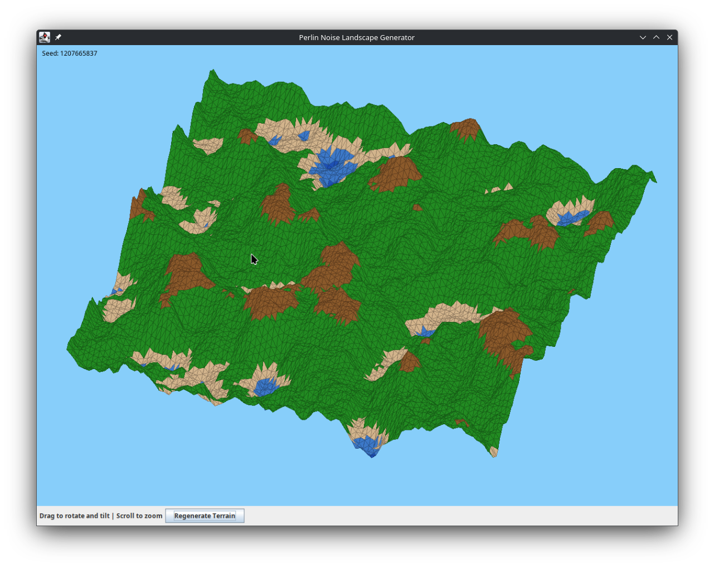

# Perlin Noise Procedural Landscape Generator

A 3D procedural terrain generator using Perlin noise algorithm, now featuring a
**first-person immersive experience**, implemented in Kotlin with real-time 3D
visualization.



## Features

### First-Person Experience

- **WASD Movement**: Navigate freely through the terrain (forward, backward,
  strafe left/right)
- **Mouse Look**: Control camera orientation with mouse movement for immersive
  exploration
- **Vertical Control**: Q/E keys to ascend and descend
- **Collision Detection**: Prevents clipping through terrain with smooth
  collision response
- **Bilinear Height Interpolation**: Smooth terrain surface traversal

### Terrain Generation

- **Perlin Noise Algorithm**: Pure implementation of Ken Perlin's noise
  algorithm for natural-looking terrain
- **Octave Noise**: Multiple noise frequencies combined for realistic fractal
  terrain details
- **Expanded Generation**: 200x200 vertex grid for detailed expansive landscapes
  (4x original size)
- **Async Generation**: Non-blocking terrain generation with visual feedback
- **Procedural Customization**: Click "Regenerate Terrain" to create new
  landscapes with different seeds

### Advanced Rendering

- **3D Visualization**: Real-time 3D rendering with perspective projection
- **Level of Detail (LOD)**: Adaptive detail levels based on camera distance for
  performance optimization
- **Frustum Culling**: Intelligent triangle culling to render only visible
  geometry
- **Render Distance**: Configurable rendering radius around player position
- **Color-coded Elevation**:
  - Deep blue: Deep water
  - Light blue: Shallow water
  - Tan: Sandy beaches
  - Green: Grasslands
  - Brown: Rocky mountains
  - White: Snow-capped peaks

### Enhanced UI

- **Heads-Up Display (HUD)**:
  - Real-time position coordinates (X, Y, Z)
  - Performance metrics (FPS counter)
  - Current viewing direction/bearing
  - Mini-map with player position and direction indicator
  - Compass rose for cardinal direction reference
- **Modern Styling**: Dark theme with blue accent colors and decorative borders
- **Responsive Controls**: Visual feedback on button interactions
- **Status Indicators**: Real-time updates on terrain generation status

## Project Structure

```plaintext
src/main/kotlin/
├── Main.kt              - Application entry point and GUI setup
├── PerlinNoise.kt       - Perlin noise algorithm implementation
├── Terrain.kt           - Terrain generation and height mapping
├── Camera.kt            - First-person camera system with WASD + mouse look
├── CollisionDetector.kt - Terrain collision detection and camera constraints
├── ViewFrustum.kt       - Camera frustum for rendering optimization
├── LevelOfDetail.kt     - Adaptive LOD system for performance tuning
├── HeadsUpDisplay.kt    - HUD rendering with stats and mini-map
└── Renderer3D.kt        - 3D rendering engine with first-person perspective
```

> [!NOTE]
> See [QUICKSTART.md](QUICKSTART.md) for step-by-step instructions on running
> and customizing the project

## Building

### Using Gradle (Recommended)

```bash
./gradlew build
```

The JAR will be created in `build/libs/perlin-1.0-SNAPSHOT.jar`

## Running

### From Gradle

```bash
./gradlew run
```

### From JAR

```bash
java -jar build/libs/perlin-1.0-SNAPSHOT.jar
```

### From IntelliJ IDEA

Open the project and run the `Main.kt` file.

## Controls

| Input              | Action                                   |
| ------------------ | ---------------------------------------- |
| **W**              | Move forward                             |
| **S**              | Move backward                            |
| **A**              | Strafe left                              |
| **D**              | Strafe right                             |
| **Q**              | Ascend (move up)                         |
| **E**              | Descend (move down)                      |
| **Mouse Movement** | Look around / rotate camera              |
| **Button Click**   | Generate new terrain with different seed |

## Technical Details

### Perlin Noise Algorithm

The implementation uses:

- Permutation table with Fisher-Yates shuffle for pseudo-randomness
- Gradient interpolation with smooth fade curves
- Octave layering for fractal detail (default: 5 octaves)
- Configurable persistence for detail control

### First-Person Camera System

- Full 6-DOF camera movement (forward/back, left/right, up/down)
- Euler angle rotation (pitch and yaw) with mouse input
- Smooth frame-rate independent movement using delta time
- Camera height offset from terrain surface
- Automatic boundary clamping to keep player within terrain bounds

### 3D Rendering

- Perspective projection with configurable FOV (90°)
- First-person camera perspective transformation
- Rotation matrices for camera orientation (yaw and pitch)
- Triangular mesh generation from height map
- Painter's algorithm for depth sorting
- View frustum culling to optimize rendering

### Performance Optimization

- **Level of Detail (LOD)**: Reduces vertex density for distant terrain
  - Distance 0-30 units: Full detail (skip rate 1)
  - Distance 30-60 units: Half detail (skip rate 2)
  - Distance 60+ units: Quarter detail (skip rate 3)
- **Render Distance**: Only renders terrain within ~100 units of player
- **Lazy Evaluation**: Triangles generated only as needed
- **Efficient Sorting**: Z-depth sorting for correct occlusion handling

### Terrain Parameters

- **Grid size**: 200x200 vertices (configurable)
- **Scale**: 0.05 (controls feature size, 0.01-0.1 recommended)
- **Octaves**: 5 (detail levels, 1-8 recommended)
- **Height multiplier**: 50.0 (vertical exaggeration for dramatic terrain)
- **Render distance**: 100 grid units
- **Movement speed**: 0.3 units per frame
- **Mouse sensitivity**: 0.1 degrees per pixel

## Customization

You can modify terrain parameters in `Main.kt`:

```kotlin
Terrain(
    width = 200,              // Grid width (default: 200)
    height = 200,             // Grid height (default: 200)
    perlinNoise,
    scale = 0.05,             // Smaller = larger features
    octaves = 5,              // Bigger = more detail
    heightMultiplier = 50.0   // Vertical scale
)
```

Camera settings can be adjusted in `Camera.kt`:

```kotlin
companion object {
    private const val MOVEMENT_SPEED = 0.3      // Units per frame
    private const val VERTICAL_SPEED = 0.2      // Units per frame (up/down)
    private const val MOUSE_SENSITIVITY = 0.1   // Degrees per pixel
}
```

Rendering parameters in `Renderer3D.kt`:

```kotlin
companion object {
    private const val FOV = 90.0
    private const val RENDER_DISTANCE = 100.0   // Grid units
}
```

## Performance Considerations

- **Grid Size**: 200x200 is the default balanced size
  - Smaller grids (100x100) for older hardware
  - Larger grids (300x300) for powerful systems
- **LOD System**: Automatically adjusts quality based on distance
- **Render Distance**: Reduce for better performance on slower systems
- **Mouse Sensitivity**: Adjust for comfortable control experience
- **FPS Counter**: Shows actual rendering performance in real-time

## Requirements

- Java 8 or higher
- Kotlin 2.2.21 or higher
- Gradle 8.0+ (for building)

## System Requirements

**Minimum:**

- Processor: Dual-core 2.0 GHz
- RAM: 512 MB
- Graphics: Integrated (software rendering)

**Recommended:**

- Processor: Quad-core 2.5 GHz
- RAM: 2 GB
- Graphics: Dedicated graphics card

## License

This project is licensed under the MIT License - see the [LICENSE](LICENSE) file
for details.
